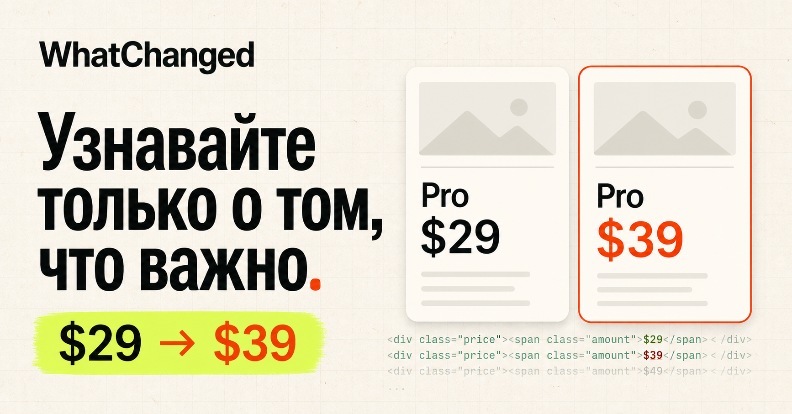

Society & Sustainability

# WhatChanged

WhatChanged следит за важными веб-страницами и объясняет изменения обычным языком. Вместо сырого HTML-diff владелец страницы получает одну фразу: что поменялось, где и насколько это существенно.



## Что уже работает

- добавление публичной страницы по URL без регистрации;
- первый снимок сразу при добавлении;
- автоматические проверки каждый час, каждые 6 часов, раз в день или раз в неделю;
- сохранение истории в Cloudflare D1;
- очистка скриптов, разметки, cookie-сообщений, временных меток и служебных токенов;
- сравнение только видимого текста и порог значимости изменений;
- понятная сводка с добавленными и удалёнными фрагментами;
- сохранённые версии страницы «до» и «после»;
- пауза, ручная проверка и удаление монитора;
- адаптивный мобильный интерфейс и встроенный демо-сценарий.

## Главный демо-сценарий

Откройте демонстрационный монитор **Formly Pricing**. WhatChanged показывает одну фразу: цена Pro выросла с $29 до $39, а в бесплатном плане появился лимит в 5 проектов. Переключатель **«Технический diff»** показывает, сколько бесполезного шума скрывается за этим коротким выводом.

Подробный план записи находится в [DEMO.md](./DEMO.md).

## Как это работает

1. Сервер получает HTML публичной страницы с ограничением размера и времени ответа.
2. Из снимка удаляются скрипты, стили, сессионные данные и повторяющиеся служебные строки.
3. Нормализованный видимый текст сравнивается с предыдущей версией.
4. Незначительные изменения отбрасываются, а содержательные превращаются в короткую фразу.
5. Исходные снимки и событие сохраняются в D1, чтобы показать честное сравнение «до/после».

## Локальный запуск

Требуется Node.js 22.13 или новее.

```bash
npm install
npm run dev
```

Проверка готовности:

```bash
npm run lint
npm run build
```

Схема базы находится в `db/schema.ts`, готовая миграция — в `drizzle/`.

## Ограничения демо-версии

WhatChanged работает с публичными HTML-страницами. Страницы за авторизацией, локальные адреса и файлы не запрашиваются. Внешние скрипты сохранённых снимков отключены. Это осознанный предел безопасной версии для демонстрации.

## Стек

React 19, vinext, Cloudflare Workers, Cloudflare D1, Drizzle ORM, TypeScript.
